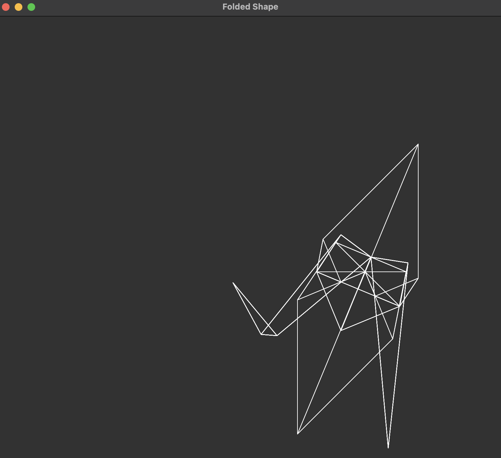
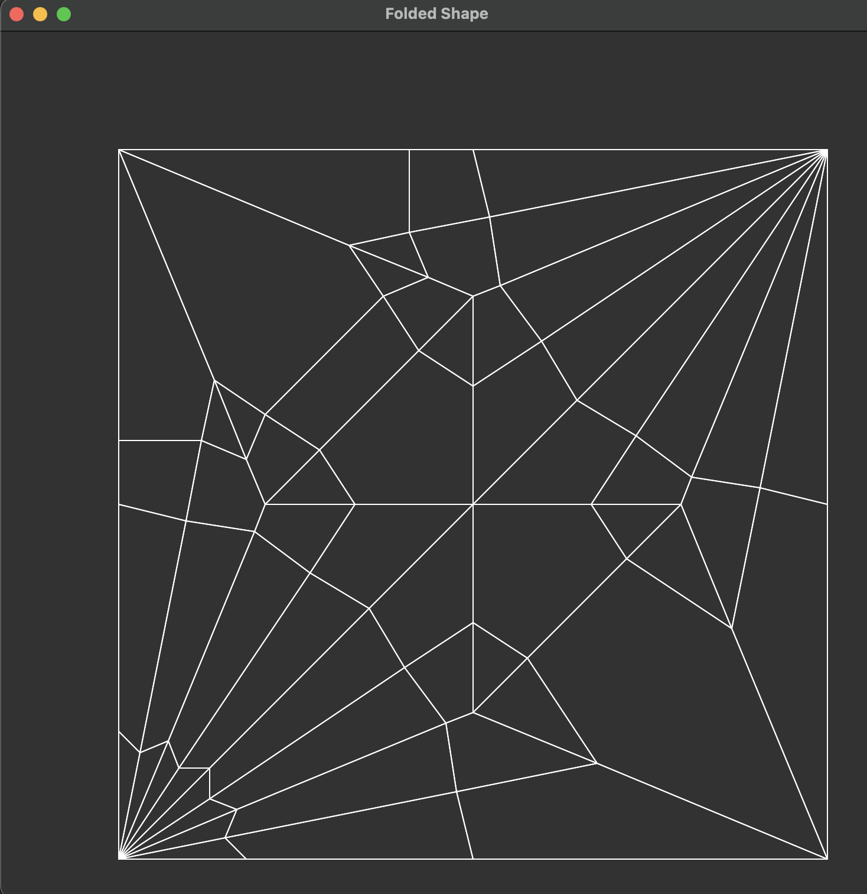
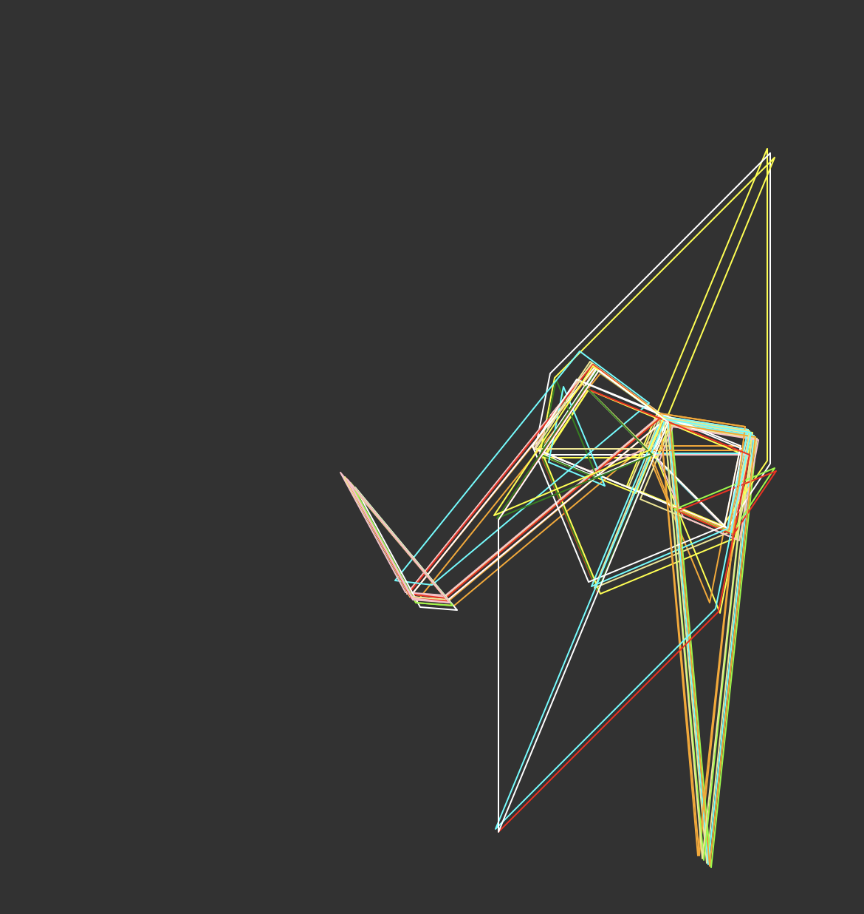
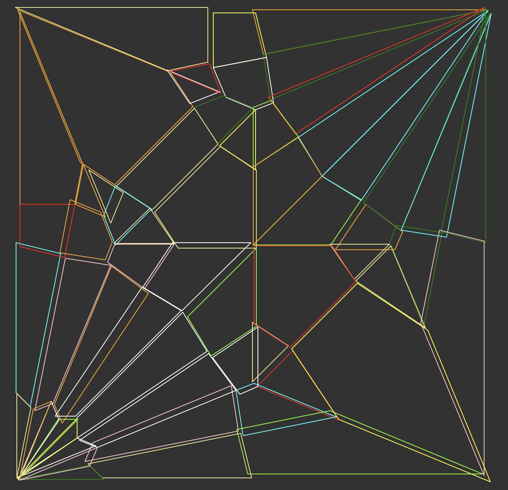

# Automated Origami Folding and Visualization

This repo contains my personal cpp implementation (and also a working python prototype) of an automated folding algorithm I came up with recently. Essentially all code in this repository was written without referencing the actual source code of any other implementation that you might find, so the algorithmic approach might be different or the same as someone else's appproach to simulating origami folding (and potentially less optimized). I hope this code is interesting and educational for anyone hoping to learn about automated origami folding!

You can pass in a (path to an) origami folding pattern (conventionally known as a [crease pattern](https://en.wikipedia.org/wiki/Crease_pattern)) in the [FOLD](https://github.com/edemaine/fold) file format with the following two base fields: 
1. "vertices_coords": x,y coordinates (ranging from 0 to 1 each) for every vertex in the origami pattern.
2. "edges_vertices": (v1, v2) pairs designating that an edge exists in the origami pattern between vertices v1 and v2. This includes the edges that lie along the four edges of the square.

and the code in the `src` repository can automatically simulate its folding and produce a visualization.

A really minimal FOLD file representing folding a square across the diagonal is:

    {
    "frame_title": "Diagonal Fold",
    "vertices_coords": [
        [0, 0],
        [1, 0],
        [1, 1],
        [0, 1]
    ],
    "edges_vertices": [
        [0, 1],
        [1, 2],
        [2, 3],
        [3, 0],
        [0, 2]
    ],
    "edges_assignment": [
        "B",
        "B",
        "B",
        "B",
        "V"
    ]
    }

Note that this repository does not do pre-checking for mountain/valley assignments of every edge or flat-folding. It assumes that any pattern used is a valid flat-folding pattern (and that some valid M/V assignment exists for it). In general these are pretty quick [axiom checks](en.wikipedia.org/wiki/Huzita–Hatori_axioms) which I wasn't very interested in implementing.

## How to use
In case anybody is interested in trying the code, you can easily run the cpp implementation on the traditional crane crease pattern with the following commands:

    cd src
    make run

There are a few options for what `make run` will automatically visualize

    // 1. The crease pattern
    dump_polygons(all_polygons);
    
    // 2. The simulated folded shape
    dump_folding_polygons(folded_form);

    // 3. specific polygons in the folded shape
    // std::vector<polygon_t> specific_polygons;
    // visualize specific polygons by pushing them onto this vector by the unique_id field
    // dump_polygons(specific_polygons);

By default `make run` will produce option 2: the simualted folded shape, although by commenting out the other options in `main.cpp` you can choose one of the other visualization targets. Below you can see options 2 and 1 respectively.

  
   

In order to circumvent weird cpp visualization library issues for anyone hoping to play with this repository, the code works by outputting a file  `out.json` containing the various polygons of the folded form (or the other forms detailed above) and using a generic tkinter python gui to create the visualization. Tkinter has some drawbacks and I might switch this out later.

By default the code simulates the `crane.fold` file in the `FOLD_examples` directory. If you want to simulate your own crease pattern, simply upload the corresponding `filename.fold` file to the `FOLD_examples` directory and run the following commands

    cd src
    make
    ./main filename # NOTE: filename does not include the .fold suffix
    python3 FOLD_visualize.py
    rm out.json # when you're done

### Visualizing Layers
One drawback of tkinter is that it can be very hard to visualize the many overlapping layers of a folded origami. Also, when writing my polygon generating code it was valuable to be able to visualize every polygon's boundaries individually at once (which can otherwise be difficult due to shared edges). So I added an alternate visual mode in `FOLD_visualize.py` accessiblye by setting `clear_vis = False` in the python code to randomly shift every polygon by a small amount and color every polygon a random color.

  
   

# General Notes
Some of this code is still being cleaned up and edited, and so it may change in the coming months. There are a few last implementation details that I will probably go through and review at some point. There are also some algorithmic improvements that I hope to add in at some point (for example a more efficient traversal of the polygon graph when actually reflecting polygons at the end of the simulation process).

# Acknowledgements
The precomputed crane.fold file was downloaded from Robby Kraft's public [.fold file library](https://github.com/robbykraft/Origami/tree/master/tests/files), although the source code contained therein was not referenced for this repository. Additionally the demos and visualization on the docs for his [Rabbit Ear](https://rabbitear.org/) library were very influential in my interest in learning about simulated origami/automated folding visualizations back in high school.